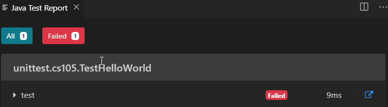
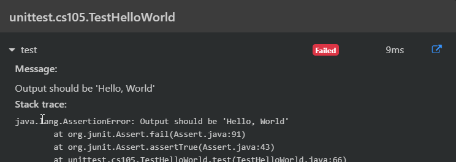

# A02 - DieSimulator

## Pre-requisites
Ensure you have completed the [tutorials](https://canvas.sbcc.edu/courses/25771/pages/tutorials?module_item_id=743777) on command line (if you are unfamiliar), git/github, and Visual Studio Code.  You will find it easier to understand if you do.

## Overview

The project name of this exercise is DieSimulator.

The purpose of this assignment is to give you a little practice problem solving, looking up Java documentation, writing unit tests, and running unit tests.

Note that all assignments must run successfully by the automated tester.  When you submit, you will receive feedback within a few minutes. Even if the code works on your machine, if it does not pass the automated grader, then you will NOT receive points for the assignment. You can resubmit until the due date. After that, you will either use up your late bank points or have the assignment reduced if you have exhausted your late bank.

## Problem Description
You are creating an object that will simulate rolling a die. A die (also called a dice) has a good description in [Wikipedia] (https://en.wikipedia.org/wiki/Dice). The relevant part for us is that when we roll a die it will give us a random number between 1 and 6. Everytime we roll it we get a new number. Of course, we can roll the same number multiple times in a row but we should eventually get a different value.

Your job is to write the code for a method called rollTheDie() that is part of the DieSimulator object. The place where your code goes is marked clearly by comments. You will also need to place your test code into Program.java and when that is working correctly you need to down load the TestDieSimulator.java code and run that to see if your code passes the test.

##Getting Started
Start this exercise using the technique on the web page titled "How to Start Every Project in this Class" for either Eclipse or VSCode. When complete you should have a Program.java file ready for you to fill with code. Replace all of the code present with the code contained in the box below:

Adding and Running Java Code
Once you have followed the instructions shown on the "How to Start Every Project in this Class" web page you should have a file called Program.java. Replace all of the code present in that file with the code shown below.
```Java
/**
 * CS 105 Theory and Practice I
 * CRN: [CHANGE THIS TO YOUR INFORMATION]
 * Assignment: DieSimulator
 * 
 * Statement of code ownership: I hereby state that I have written all of this
 * code and I have not copied this code from any other person or source.
 * 
 * @author [CHANGE THIS TO YOUR INFORMATION]
 */
package edu.sbcc.cs105;

/**
 * This class tests the DieSimulator object.
 *
 */
public class Program {

    /**
     * This method creates a DieSimulator object and repeatedly invokes its
     * rollTheDie method. The hope is that there are enough calls here to show
     * that the simulator works properly.
     * 
     * @param args
     *            command line values. Not used in this example.
     */
    public static void main(String[] args) {
        DieSimulator ds = new DieSimulator();

        System.out.println("    One die roll is " + ds.rollTheDie());
        
        // Add more of these until you are convinced the code works
        // correctly.
        System.out.println("Another die roll is " + ds.rollTheDie());
    }

}
```
You can simply copy the code from the box and paste it into the Program.java file. Go through the code and replace every instance of [CHANGE THIS TO YOUR INFORMATION] to the appropriate information. Be sure that the square brackets are removed when replace the text. There are two items that need to be changed.

Next, Create another file called DieSimulator.java in the SAME folder as Program.java. Replace the code in that file with the code in the box below. This one is a little tougher because you have to edit the calculation in getProduct to return the product of the two passed operands. You should be able to figure this out from the completed method

```Java
/**
 * CS 105 Theory and Practice I
 * CRN: [CHANGE THIS TO YOUR INFORMATION]
 * Assignment: DieSimulator
 * 
 * Statement of code ownership: I hereby state that I have written all of this
 * code and I have not copied this code from any other person or source.
 * 
 * @author [CHANGE THIS TO YOUR INFORMATION]
 */
package edu.sbcc.cs105;

import java.util.*;

/**
 * This class simulates rolling a die by generating a random number between 1
 * and 6 inclusive.
 *
 */
public class DieSimulator {

    /**
     * Simulates the roll of a six-sided die
     * 
     * @return a random integer from 1 to 6 inclusive.
     */
    public int rollTheDie() {
        int randomDieRoll = 1 + Random.nextInt(5);

        
        return randomDieRoll;
    }
}
```

Similar to the Program.java file go through DieSimulator.java and change the [CHANGE THIS TO YOUR INFORMATION] text to the proper items. There are two items to be changed.

You need to add code to generate a random number from 1 to 6 inclusive. To do that you'll need to use the Random object which is a part of the Java library. There is a ([description of the Random object](https://docs.oracle.com/en/java/javase/12/docs/api/java.base/java/util/Random.html) online. Read this documentation to get an understanding of how to use the Random object. Before running to Google for the answer on how to generate a number from 1 to 6 please spend a little time thinking about it and solve it on your own. Look and see what you have to work with and how you can get the answer you want. Being able to develop that algorithm is a key skill in computer science.

Once you've written your code run the code by single clicking on Program.java in the package explorer and selecting Run->Run from the menu or using the keyboard shortcut. Examine the output. Does it do what you want? If not, how can you modify the code to do what you want?

What you've done is create an object that solves a particular problem and then tested it with the code that was found in Program.java. You also properly documented the code using Javadoc. This is a very typical structure for exercises in this class. You will be given a problem which you will solve using one or more objects that you write. In this case there was only one object which was specified by the DieSimulator.java class. The test code was found in Program.java and this code created a DieSimulator object and then used it. It showed the output which can be examined for correctness.


## Run Unit Tests

In the Visual Studio Code Activity Bar (docked on the left edge of the applicatoin), select the Beaker icon (Unit Tests). To run the unit test, select the item that starts with the word Test (in this case TestMultiply) and click the run button.  If it succeeds, you should see an All and a green Passed status indicator with the number of tests in each. Hopefully, the number passed equals the total number.  If something fails, you'll see a red Failed status indicator. To see what went wrong, expand the Test method

**Unit Test Runner**


**Failed Test Run**



**Failed Test Run Details**



**Successful Test Run** 


## How to turn in this exercise ##
Follow the instructions in Canvas on "How to Submit Assignments"

