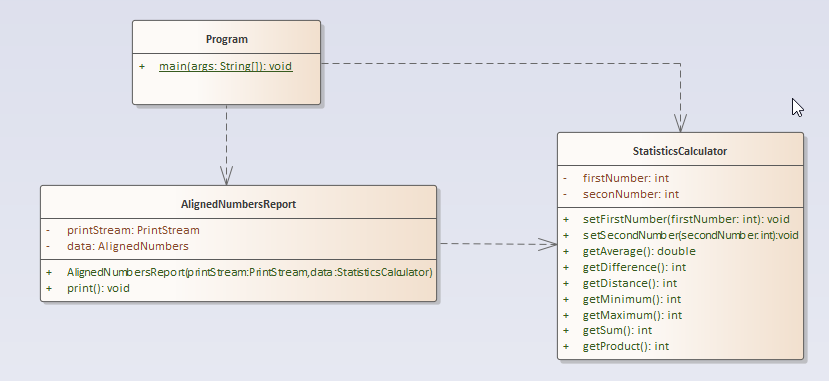

# A07 - AlignedNumbers

# Overview

The project name of this exercise is **AlignedNumbers**.

The purpose of this assignment is for you to write more of your own comments and to a solution that has multiple classes with different responsibilities as well as get familiar with multiple data types and formatted print statements. You should also be examining the relationships between the different classes in the program

## Problem Description

You are going to write a class that will calculate the mathematical operations described below. Additionally, it print out the statistics where each statistic is labelled and the values aligned on the decimal point (see example output below). You are to solve this problem by writing two classes called **StatisticsCalculator** and **AlignedNumbersReport**. The **StatisticsCalculator** class will implement each mathematical operation as a separate method. 

- getAverage() - The average of the two numbers
- getDifference() - The difference between the first and second number (see example output for guidance)
- getDistance() - The absolute value of the difference between the first and second number
- getMaximum() - The greater of the values between the first and second number. **You may NOT use Math.max to calculate this**.
- getMinimum() - The lesser of the values between the first and second number. **You may NOT use Math.min to calculate this**.

The **AlignedNumbersReport** is responsible for printing out the generated statics in a tabular format where the decimal points are aligned. This will require the use of the printf function from a PrintStream object. You have thus far been using the System.out PrintStream to print output in earlier programs.  

The **StatisticsCalculator** object created from our class will be tested in your **Program.java** file. The test should ask the user for two integers and calculate the specified statistics for the two numbers.  You will then create an instance of the **AlignedNumbersReport** which will require a **PrintStream** object (pass System.out) and an instance of **StatisticsCalculator** to be passed to its constructor. Therefore you must create this object last.

 The UML diagram for this problem is shown below. Be sure to understand how the UML relates to the code that is present. Your code should match the UML as far as the public interface is concerned.




Notice the dependency arrow from **Program** to **StatisticsCalculator** and **AlignedNumbersReport** . This shows you that the **Program** class requires both the **StatisticsCalculator** and **AlignedNumbersReport** classes to work properly.  **AlignedNumbersReport** also depends on **StatisticsCalculator** because its constructor requires an instance of **StatisticsCalculator** to be passed to it

Here is a sample of how you will test the code. When the program is run you will ask the user for two integer numbers. Do not worry about error checking; the integer inputs will always be valid.

```
Input first number: 20
Input second number: 25
```

You then print all of the statistics using the ***exact*** format below. Your print method must generate this exact format for any two integers between 1 and 1000. You must also use a platform independent line ending (i.e. use %n and NOT \n) that will produce the correct output even if you write it on Linux and run it on Windows later or vice versa.

```
Sum:                        45
Average:                    22.50
Difference:                 -5
Product:                   500
Distance:                    5
Maximum:                    25
Minimum:                    20
```

Requirements:

- Use %n for EOL in the printf
- Don't hard code spaces to create the alignment. Use format specifiers to achieve that (%d, %f)
- You may not print ANYTHING out from **StatisticsCalculator**. It's only job is to, well, calculate statistics.
- You may not directly print to System.out within the **AlignedNumbersReport** object. Use the passed in PrintStream object.

Hints:

1. 1. There are 30 characters in the first line starting with "S" and ending with "5".
   2. The ones digits are all aligned.
   3. Use the `System.out.printf` method. One thing to watch here is the difference of using %n for new line vs \n.  Try both to see behavior, but you'll find that you want to use %n because then both your code and the tester will perform the same regardless of what platform it is run on (Linux or Windows)

## Getting Started

Like our last exercise, we are going to do this exercise by writing the object that solves the problem first (in source files called **StatisticsCalculator.java** and **AlignedNumbersReport.java**) and then testing it using code we write into **Program.java**. In the *src/main/java/edu/sbcc/cs105 folder* create all three of the files mentioned above  (Select the folder in VS Code and then click the New File icon on the project bar or select File >> New File from the menu (Ctrl + N)).

Create the **StatisticsCalculator.java** file and replace the code with the code contained in the box below:

```java
/**
 * CS 105 Theory and Practice I
 * CRN: [CHANGE THIS TO YOUR INFORMATION]
 * Assignment: AlignedNumbers
 * 
 * Statement of code ownership: I hereby state that I have written all of this
 * code and I have not copied this code from any other person or source.
 * 
 * @author [CHANGE THIS TO YOUR INFORMATION]
 */
package edu.sbcc.cs105;


public class StatisticsCalculator {     

}
```

Look at this code and compare it to the specification above. You will need to add all of the methods and instance variables to the source code. You will also have to add Javadoc documentation to the code. This is especially relevant because you should give a (very) brief explanation of what the code does. 

Next, using the same technique you used above and create the **AlignedNumbersReport.java** file.  Copy the code above from **StatisticsCalculator** into the **AlignedNumbersReport.java** file, but then change the name of the class to **AlignedNumbersReport**.

 Finally, create another file called **Program.java**. This is where your test code will go. Replace the code in that file with the code in the grey box below:

```java
/**
 * CS 105 Theory and Practice I
 * CRN: [CHANGE THIS TO YOUR INFORMATION]
 * Assignment: AlignedNumbers
 * 
 * Statement of code ownership: I hereby state that I have written all of this
 * code and I have not copied this code from any other person or source.
 * 
 * @author [CHANGE THIS TO YOUR INFORMATION]
 */
package edu.sbcc.cs105;

import java.util.*;

public class Program {

    /**
     * Test this code by asking for two numbers, computing the various stats,
     * and then printing it out.
     * 
     * @param args
     *            command line values. Not used in this example.
     */
    public static void main(String[] args) {

    }
}
```

Go through **Program.java** and change the **[CHANGE THIS TO YOUR INFORMATION]** text to the proper items. There are two items to be changed.

**NOTICE** No JavaDocs have been provided for you this time. You need to do these yourself. Points will be deducted if you do not.

You will also notice that **Program.java** does not contain any test code. Write some test routines based upon the problem description and follow the input and output examples closely. Once you've written your code run the code by right clicking on **Program.java** in the file explorer and selecting **Run** from the context menu or using the debug tool from the **Activity Bar**. Examine the output. Does it do what you want? If not, how can you modify the code to do what you want?

## Running Unit Tests

Don't forget to run unit tests. The unit test is called TestAlignedNumbers.java

**YOUR UNIT TESTS MUST PASS BEFORE SUBMITTING THE FILE OR YOU GET NOTHING (Reference to the original Charlie and the Chocolate Factory).**

## No UML Diagram for the Project

You do not need to create a UML diagram as one has been provided for you

## Submitting Your Assignment

Follow the standard instructions for submitting a Java assignment: [How to Submit Assignments](https://canvas.sbcc.edu/courses/25771/pages/how-to-submit-assignments-new?module_item_id=761292)
