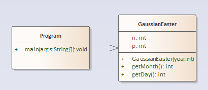

# A08 - GaussianEaster

# Overview

The project name of this exercise is **GaussianEaster**.

The purpose of this assignment is for you to write more of your own comments and to create methods that are not strictly accessors or mutators. You should also be examining the relationships between the UML diagram and the Java code..

## Problem Description

You can find a detailed description of the Gaussian Easter Algorithm and how it is derived at: https://math.stackexchange.com/questions/896954/decoding-gauss-easter-algorithm

**Algorithm**

1. Let y be the 4-digit year (e.g. 2018)
2. Divide y by 19 and call the remainder a. Ignore the quotient.
3. Divide y by 100 to get a quotient b and a remainder c.
4. Divide b by 4 to get a quotient d and a remainder e.
5. Divide 8 * b + 13 by 25 to get a quotient g. Ignore the remainder.
6. Divide 19 * a + b - d - g + 15 by 30 to get a remainder h. Ignore the quotient.
7. Divide c by 4 to get a quotient j and a remainder k.
8. Divide a + 11 * h by 319 to get a quotient m. Ignore the remainder.
9. Divide 2 * e + 2 * j - k - h + m + 32 by 7 to get a remainder r. Ignore the quotient.
10. Divide h - m + r + 90 by 25 to get a quotient **n**. Ignore the remainder.
11. Divide h - m + r + n + 19 by 32 to get a remainder **p**. Ignore the quotient.

 Note: The month is the resultant value of **n** and the day is **p**

This problem should be solved using the objects shown in the UML diagram below. The two attributes should use the (terrible) variable names given in the programming project. You will want to implement the algorithm inside of the Constructor for the GaussianEaster object. All of the rest of the variables mentioned in the algorith should be **local** variables, not **instance** variables. Note that the arguments are backwards from Java code (e.g. **y : int** is **int y** in Java). Don't forget the "+" means public and "-" means private with underline meaning static method. The type after a methods colon located after the parenthesis is the return type.



Using the test year of 2001 shown in the book the output should look like:

```
**Year: 2001 Month: 4 Day: 15**
```

## Getting Started

Like our last exercise, we are going to do this exercise by writing the object that solves the problem first (in a source file called **GaussianEaster.java**) and then testing it using code we write into **Program.java**. Using the techniques shown on the instruction page [How to Start Every Java Project in this Course](https://canvas.sbcc.edu/courses/25771/modules/items/760779), create a new project from the GitHub classroom assignment.

Create the following files and add the appropriately named classes to them

1. Program.java
2. GaussianEaster.java


Open up each class file and create the class structure. Add the following header to each file:

```java
/**
 * CS 105 Theory and Practice I
 * CRN: [CHANGE THIS TO YOUR INFORMATION]
 * Assignment: LetterSize
 * 
 * Statement of code ownership: I hereby state that I have written all of this
 * code and I have not copied this code from any other person or source.
 * 
 * @author [CHANGE THIS TO YOUR INFORMATION]
 */

```

**You'll have to add the proper Javadoc documentation** as well as the proper code to solve the problem. You will have to add instance variables, constants, method stubs, and code to get this class defined properly. Read the comments (and the problem) to understand what the problem is and how you will solve it.  

You will need to add test code to **Program.java** to test the **GaussianEaster.java** source code. For your test code you can use this kind of case:

```
Input Easter year: 2001
Year: 2001 Month: 4 Day: 15
```

The green text indicates the user input which in this case is 2001. The output is computed and output as shown.


Once you've written your code run the code by right clicking on **Program.java** in the file explorer and selecting **Run** from the context menu or using the debug tool from the **Activity Bar**. Examine the output. Does it do what you want? If not, how can you modify the code to do what you want?

## Running Unit Tests

Don't forget to run unit tests. The unit test is called TestEmployee.java

**YOUR UNIT TESTS MUST PASS BEFORE SUBMITTING THE FILE OR YOU GET NOTHING (Reference to the original Charlie and the Chocolate Factory).**

## No UML Diagram for the Project

No UML diagram is required for this project as one has been provided for you.

## Submitting Your Assignment

Follow the standard instructions for submitting a Java assignment: [How to Submit Assignments](https://canvas.sbcc.edu/courses/25771/pages/how-to-submit-assignments-new?module_item_id=761292)
