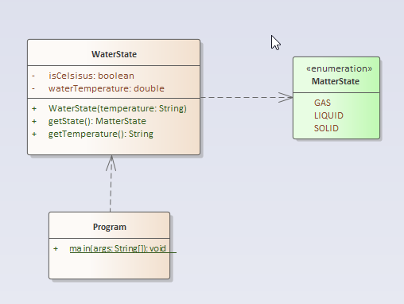

# A12 - WaterState

# Overview

The project name of this exercise is **WaterState**.

The purpose of this assignment is for you to gain experience using nested if statements. You will also get some practice using enumeration.

## Problem Description

You are to implement a program which tracks the state of water. This will be implemented using the UML shown below.

The temperature String passed to the constructor will be something like "100C" for 100 degrees Centigrade or "-20F" for minus 20 degrees Fahrenheight. You need to take that String and set your instance variables in the constructor.

The **getState** method returns one of the MatterState enumerated types. In UML, the values of the enumerated types are given by the attributes. You don't need to use the text **<<enumeration>>** at all in your Java code. It is just a way of indicating (called a stereotype) that the element represents an enumerated type.

Th **getTemperature** method returns the original temperature string. However, you may not store the temperature as a string, but convert it from its discrete components (waterTemperature and isCelsius attributes)

DO NOT convert the temperature from its input value

**Hints:**

- You might want to use the substring method of the `**String**` object.
- You can print the **MatterState** enumerated type directly.
- Enumerated types, also called enum, have a template under eclipse like when you create a class.
- The enumerated type will have a separate source file.

**Requirements:**

- Do **NOT** convert the provided temperature, either upon receiving it or when checking the matter state. While this may be more efficient and clean, this assignment expects you to deal with the data, **as provided**, to determine the state.
- You may not add any attributes - Therefore, you must parse and convert the temperature on the way in and also on the way out (**getTemperature** method)

## Getting Started

Using the techniques shown on the instruction page [How to Start Every Java Project in this Course](https://canvas.sbcc.edu/courses/25771/modules/items/760779), create a new project from the GitHub classroom assignment.

Create the following files in the **src/main/java/edu/sbcc/cs105** folder and add the appropriately named classes to them

1. Program.java
2. WaterState.java
3. MatterState.java

Open up each class file and create the class structure. Add the standard header to the file.  The template for this header is available at: https://drive.google.com/open?id=1XLCgOqdXc9p7syhL0-VGlCc-q12actG-

**You'll have to add the proper Javadoc documentation** as well as the proper code to solve the problem. You will have to add instance variables, constants, method stubs, and code to get this class defined properly. Read the comments (and the problem) to understand what the problem is and how you will solve it.  

You will need to add test code to **Program.java** to test the **WaterState.java** source code. 

Once you've written your code run the code by right clicking on **Program.java** in the file explorer and selecting **Run** from the context menu or using the debug tool from the **Activity Bar**. Examine the output. Does it do what you want? If not, how can you modify the code to do what you want?

## Running Unit Tests

Don't forget to run unit tests. The unit test is called TestEmployee.java

**YOUR UNIT TESTS MUST PASS BEFORE SUBMITTING THE FILE OR YOU GET NOTHING (Reference to the original Charlie and the Chocolate Factory).**

## No UML Diagram for the Project

No UML diagram is required for this project as one has been provided for you.

## Submitting Your Assignment

Follow the standard instructions for submitting a Java assignment: [How to Submit Assignments](https://canvas.sbcc.edu/courses/25771/pages/how-to-submit-assignments-new?module_item_id=761292). Once you have submitted your assignment, it is a good idea to check the branches section of GitHub a few minutes later to see if your unit tests passed on the build server (green checkmark is good, red X is bad)
