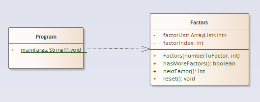

# A16 - Factors

# Overview

The project name of this exercise is **Factors**.

The purpose of this assignment is to gain more experience with ArrayLists and **while** loops. Additionally, you get experience solving a more algorithmically complex problem.

## Problem Description

You are going to write a program that finds the [prime factors (Links to an external site.)](http://www.mathsisfun.com/prime-factorization.html) of a number.



The user creates a **Factors** object which passes the number they want factored in the constructor.  As part of construction, the Factors object calculates all the prime factors for the specified number. Once constructed, the object consumer can print out all of the factors present using a while loop. The UML above contains all of the instance variables and methods needed to implement the problem. You will probably need some local variables also to fully implement this.

**Explanation of Methods:**

- Use the constructor to initiate the calculation of the factors. You may want to consider delegating some or all of the work to additional private methods. All the calculated factors should be added to the factorList instance variable
- **hasMoreFactors()** and **nextFactor()** are meant to be utilized *within a loop* (in your Program class) by a consumer of the class **ONLY AFTER** the factors have been calculated. They are NOT used in the calculation of the factors. Essentially, the pattern (for the consumer) is: while there are factors, get the next factor. Use the factorIndex as an internal counter for each pass through the loop.
- **hasMoreFactors()** should use the factorIndex and compare it to the factorList boundary to determine if the end has been reached.
- **getNextFactor()** should use the current factorIndex to determine which factor to retrieve and, of course, increment the factor.
- **reset()** resets the factorIndex so that the loop through the factors can be run multiple times

Your `**Program.java**` should contain code to test your` **Factors**` object.

**Requirements:**

- You cannot hard-code an upper boundary for the Factors or the actual factors themselves. It must accommodate any valid integer as an input to the constructor
- All loops **must** be **`while`** loops.

**Hints:**

- The parameter passed to the constructor will always be integers greater than or equal to 2.
- Compute all of the factors in the constructor or in method called by the constuctor
- There are multiple ways to calculate the factors
- You DO NOT need nest loops to do the calculation of factors.
- Use factorIndex to remember where you are in the factor ArrayList.
- Don't forget about integer division and modulo!


Your **Program.java** should contain code to test your **Factors** object. Ask the user for input (using a scanner) and outputs the factors sequentially. If you input 150 then your output should look like this (note that a prime factor can appear more than once):

```
2
3
5
5
```

Notice that the numbers are in ascending order. You will need to do that too.

## Getting Started

Using the techniques shown on the instruction page [How to Start Every Java Project in this Course](https://canvas.sbcc.edu/courses/25771/modules/items/760779), create a new project from the GitHub classroom assignment.

Create the following files in the **src/main/java/edu/sbcc/cs105** folder and add the appropriately named classes to them

Open up each class file and create the class structure. Add the standard header to the file.  The template for this header is available at: https://drive.google.com/open?id=1XLCgOqdXc9p7syhL0-VGlCc-q12actG-

**You'll have to add the proper Javadoc documentation** as well as the proper code to solve the problem. You will have to add instance variables, constants, method stubs, and code to get this class defined properly. Read the comments (and the problem) to understand what the problem is and how you will solve it.  

You will need to add test code to **Program.java** to test your classes

Once you've written your code run the code by right clicking on **Program.java** in the file explorer and selecting **Run** from the context menu or using the debug tool from the **Activity Bar**. Examine the output. Does it do what you want? If not, how can you modify the code to do what you want?

## Running Unit Tests

Don't forget to run unit tests. The unit test is called **TestFactors.java**

**YOUR UNIT TESTS MUST PASS BEFORE SUBMITTING THE FILE OR YOU GET NOTHING (Reference to the original Charlie and the Chocolate Factory).**

## No UML Diagram for the Project

No UML diagram is required for this project as one has been provided for you.

## Submitting Your Assignment

Follow the standard instructions for submitting a Java assignment: [How to Submit Assignments](https://canvas.sbcc.edu/courses/25771/pages/how-to-submit-assignments-new?module_item_id=761292). Once you have submitted your assignment, it is a good idea to check the branches section of GitHub a few minutes later to see if your unit tests passed on the build server (green checkmark is good, red X is bad)
