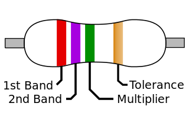
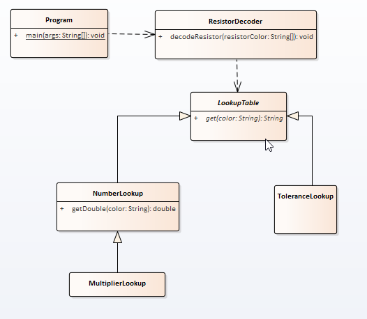

# A22 - ResistorDecoder

# Overview

The project name of this exercise is **ResistorDecoder**.

The purpose of this assignment is to learn how to work with inheritance, selection, and string processing as well as how to write all of your own code and Javadoc comments.

## Problem Description

Resistors are electronic devices which resist the flow of current through an electronic circuit. The values of a resistor are given in Ohms (Ω) and are standardized with an [electronic color code (Links to an external site.)](https://en.wikipedia.org/wiki/Electronic_color_code#Resistor_color-coding). We are going to use a four band color code as shown below:



For a given set of four colors we look up each color in sequence. For the example shown the first band (1st) is red which corresponds to the number "2". The second (2nd) band is Violet which is the number "7". The multiplier is Green which is "x105". Lastly, the tolerance is given as a Gold band which corresponds to "±5%". The expected value is 27x105 Ohms with a tolerance of ±5%. This is written as:

2.7MΩ, ±5%

You will notice that the raw numerical value is 2700000 ohms which is made "human-friendly" by writing it in terms of Megaohms. The same logic applies to Kiloohms as well. The numerical values used are given in the table below which is adapted from the [Wikipedia page (Links to an external site.)](https://en.wikipedia.org/wiki/Electronic_color_code#Resistor_color-coding).

| Color  | 1st and 2nd Bands | Multiplier | Tolerance |
| ------ | ----------------- | ---------- | --------- |
| Black  | 0                 | ×10^0       |           |
| Brown  | 1                 | ×10^1       | ±1%       |
| Red    | 2                 | ×10^2       | ±2%       |
| Orange | 3                 | ×10^3       |           |
| Yellow | 4                 | ×10^4       | ±5%       |
| Green  | 5                 | ×10^5       | ±0.5%     |
| Blue   | 6                 | ×10^6       | ±0.25%    |
| Violet | 7                 | ×10^7       | ±0.1%     |
| Gray   | 8                 | ×10^8       | ±10%      |
| White  | 9                 | ×10^9       |           |
| Gold   | –                 | ×10−1      | ±5%       |
| Silver | –                 | ×10−2      | ±10%      |
| None   | –                 | –          | ±20%      |
|        |                   |            |           |

Your job will be to write code to take an array of colors and translate that into a nice human readable string. To do so you will implement the public interface of your objects according to the following UML diagram.

Note: Method `decodeResistor` should return String even though diagram says void



The `ResistorDecoder` object will be the object used by your Program`.java` to translate the array of colors into the human-friendly string. The `ResistorDecoder` will need several different types of lookup tables depending upon whether we are looking up a String from the colors or a numerical value. 

The `LookupTable` object is an abstract class since it contains an abstract method `get()`. 

The `ToleranceLookup` object takes a color and returns a String which is the tolerance string (e.g. ±5%). 

`The NumberLookup` object takes a color and can return a String but it also can return a Double. Since we are extending the `LookupTable` object (it didn't have the ability to return a double before) we need to inherit from the `LookupTable` object. 

The `MultiplierLookup` object works in a similar way to the `NumberLookup object` but the internal lookup tables are different. Therefore we need to inherit from the `NumberLookup` table even though we don't need to add any methods. 

Hint: Can you make the MultiplierLookup use the NumberLookup's getDouble behavior to simplify its responsibility?

## Getting Started

Using the techniques shown on the instruction page [How to Start Every Java Project in this Course](https://canvas.sbcc.edu/courses/25771/modules/items/760779), create a new project from the GitHub classroom assignment.

Create the following files in the **src/main/java/edu/sbcc/cs105** folder and add the appropriately named classes to them

1. Program.java
2. ResistorDecoder.java
3. LookupTable.java
4. NumberLookup.java
5. Multiplier.java
6. ToleranceLookup.java

Open up each class file and create the class structure. Add the standard header to the file.  The template for this header is available at: https://drive.google.com/open?id=1XLCgOqdXc9p7syhL0-VGlCc-q12actG-

**You'll have to add the proper Javadoc documentation** as well as the proper code to solve the problem. You will have to add instance variables, constants, method stubs, and code to get this class defined properly. Read the comments (and the problem) to understand what the problem is and how you will solve it.  

You will need to add test code to **Program.java** to test your source code. 

Once you've written your code run the code by right clicking on **Program.java** in the file explorer and selecting **Run** from the context menu or using the debug tool from the **Activity Bar**. Examine the output. Does it do what you want? If not, how can you modify the code to do what you want?

## Testing Your Code

Your **Program.java** should contain code to test your `ReistorDecoder.java` object. Here is a sample of the test code:

```Java
ResistorDecoder r = new ResistorDecoder();
String[] resistor0 = { "Black", "Brown", "Black", "Gold" };
System.out.println("Expected output: 1Ω, ±5% Actual output: " + r.decodeResistor(resistor0));
```

The output for the code above is:

```
Expected output: 1Ω, ±5% Actual output: 1Ω, ±5%

Hint: If you are having trouble getting the unit tests to pass due to bizarre characters in place of the ohms and +/-, it is because the text encoding of the IDE is set to the wrong encododing instead of utf-8.  To fix this, change it by opening settings ([Ctrl] + [,]). Then find the "files.encoding" setting and change it to utf8
```

Below is a table which gives you some sample colors and the expected output. Pay particular attention to the format of the output string. Yours will have to match exactly.

| Colors | Output |        |        |              |
| ------ | ------ | ------ | ------ | ------------ |
| Yellow | Violet | Red    | Violet | 4.7KΩ, ±0.1% |
| Brown  | Black  | Violet | Brown  | 100MΩ, ±1%   |

Be sure to test the different values **before** running my unit test.

Once you've written your code run the code by single clicking on ***\*Program\**.java** in the package explorer and selecting **Run->Run** from the menu or using the keyboard shortcut. Examine the output. Does it do what you want? If not, how can you modify the code to do what you want?

## Running Unit Tests

Don't forget to run unit tests. The unit test is called **TestResistorDecoder.java**

**YOUR UNIT TESTS MUST PASS BEFORE SUBMITTING THE FILE OR YOU GET NOTHING (Reference to the original Charlie and the Chocolate Factory).**

## No UML Diagram for the Project

No UML diagram is required for this project as one has been provided for you.

Create a UML diagram for this class based upon the specifications including all classes and relationships

## Submitting Your Assignment

Follow the standard instructions for submitting a Java assignment: [How to Submit Assignments](https://canvas.sbcc.edu/courses/25771/pages/how-to-submit-assignments-new?module_item_id=761292). Once you have submitted your assignment, it is a good idea to check the branches section of GitHub a few minutes later to see if your unit tests passed on the build server (green checkmark is good, red X is bad)

 Image credit: "4-Band Resistor" by Jjbeard - [https://commons.wikimedia.org/wiki/File:4-Band_Resistor.svg (Links to an external site.)](https://commons.wikimedia.org/wiki/File:4-Band_Resistor.svg). Licensed under [Public Domain (Links to an external site.)](https://en.wikipedia.org/wiki/Public_domain) via [Wikimedia Commons (Links to an external site.)](http://commons.wikimedia.org/wiki/). 
