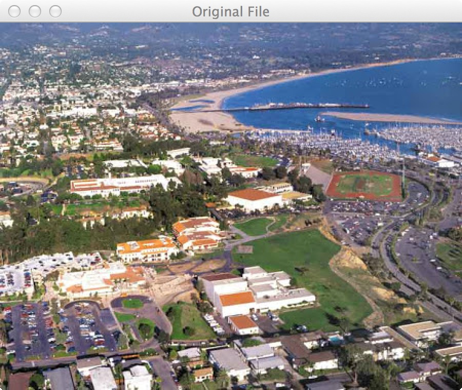
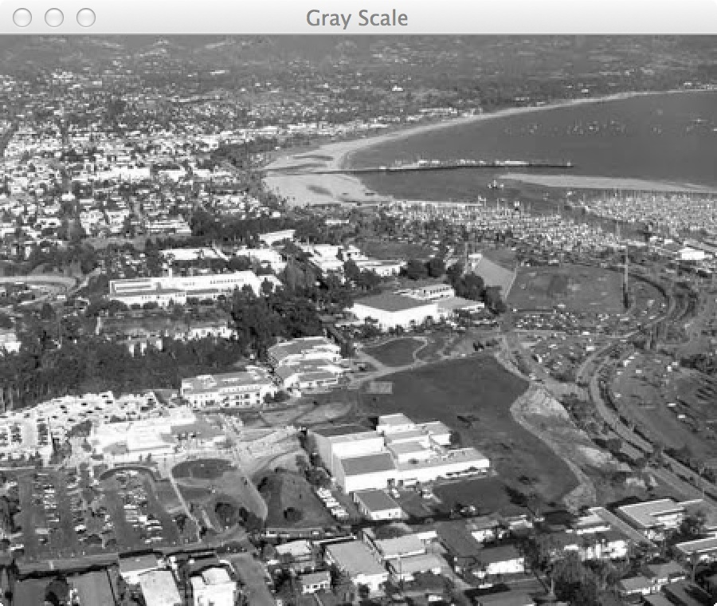

# A23 - Instafilter

# Overview

The project name of this exercise is **Instafilter**.

The purpose of this assignment is to learn how to work with Interfaces, iteration, 2-D Arrays, and image processing. You get more practice on how to write all of your own code and Javadoc comments.

## Problem Description

You are going to extend a simple image processing application (ala Instagram) called Instafilter to create a set of three effects that can be applied to an image. The effects (called filters) are Gray Scale, Sepia Tone, and Blur. These filters are all created by implenting the [Filterable interface (Links to an external site.)](http://sbccutils.azurewebsites.net/sbccutils/Filterable.html).

The **Gray Scale** filter (**`GrayScale.java`**) will take the input image and make it a gray scale image. To make a gray scale pixel you have to add the R channel to the G channel to the B channel and divide by 3. The resultant number is then put back into the R, G, and B channels.

The **Blur** filter (**`Blur.java`**) takes the nearest neighbor pixels (like what we did in class) and averages them. This takes the place of the center pixel. Note that you don't have to process the outermost pixels since they don't have a complete set of nearest neighbors. Also note that you have to do each channel separately. BE SURE TO CALL the clone method of PixelArray and 1) ONLY READ from the passed in PixelArray and 2) ONLY WRITE the clone. If you modify the passed in PixelArray, it will affect next row / next column operations.

The **Sepia Tone** (**`Sepia.java`**) filter uses the following formula:

red = (red * .393) + (green * .769) + (blue * .189)
green = (red * .349) + (green * .686) + (blue * .168)
blue = (red * .272) + (green * .534) + (blue * .131)

Note that you must have each channel set to an integer number between 0 and 255. If a number is over 255 then you need to set it to 255.

Take a look at the [Javadoc for sbccutils (Links to an external site.)](http://sbccutils.azurewebsites.net/) to learn about the `Filterable` interface. The filter you will write will take a [PixelArray (Links to an external site.)](http://sbccutils.azurewebsites.net/sbccutils/PixelArray.html) as an argument and return a (presumeably) filtlered PixelArray. A PixelArray is a 2-D array of [Pixel (Links to an external site.)](http://sbccutils.azurewebsites.net/sbccutils/Pixel.html) objects where each Pixel object is simply the red, green, and blue channels of a pixel.

## Getting Started

Using the techniques shown on the instruction page [How to Start Every Java Project in this Course](https://canvas.sbcc.edu/courses/25771/modules/items/760779), create a new project from the GitHub classroom assignment.

Create the following files in the **src/main/java/edu/sbcc/cs105** folder and add the appropriately named classes to them

1. Program.java
2. Instafilter.java
3. GrayScale.java
4. Blur.java
5. Sepia.java

Open up each class file and create the class structure. Add the standard header to the file.  The template for this header is available at: https://drive.google.com/open?id=1XLCgOqdXc9p7syhL0-VGlCc-q12actG-

**You'll have to add the proper Javadoc documentation** as well as the proper code to solve the problem. You will have to add instance variables, constants, method stubs, and code to get this class defined properly. Read the comments (and the problem) to understand what the problem is and how you will solve it.  

You will need to add test code to **Program.java** to test your source code. 

The first code you should write is the **Program**.**java** source file. In it you should put the following code:

```
Instafilter instafilter = new Instafilter();

// instafilter.addFilter(new GrayScale());
instafilter.run();
```

Before you run this code make sure you've imported the image file [sbcc.jpg](https://canvas.sbcc.edu/courses/19827/files/6254159/download?wrap=1) into your project. Once imported run it. You'll see a user interface. Load the image file and see it show up on your screen! It should look similar to what is shown below:



You'll be writing code to modify these images which will pop up in their own window. In the sample the GrayScale filter has been commented out. When you write yours you will need to uncomment that code to get it to work. For reference the GrayScale filter output looks like this (note the name on the top of the frame):

 

- Read the [Javadoc information on sbccutils (Links to an external site.)](http://sbccutils.azurewebsites.net/).
- The Instafilter application asks the filter for its name to help create the menu. How can you give a sensible name to your filter? What method needs to be overridden?


Once you've written your code run the code by right clicking on **Program.java** in the file explorer and selecting **Run** from the context menu or using the debug tool from the **Activity Bar**. Examine the output. Does it do what you want? If not, how can you modify the code to do what you want?

## Running Unit Tests

Don't forget to run unit tests. The unit test is called **TestInstafilter.java**

**YOUR UNIT TESTS MUST PASS BEFORE SUBMITTING THE FILE OR YOU GET NOTHING (Reference to the original Charlie and the Chocolate Factory).**

## UML Diagram for the Project

You will need to create and submit a UML diagram that shows the classes and relationships, including the use of the interface concept

## Submitting Your Assignment

Follow the standard instructions for submitting a Java assignment: [How to Submit Assignments](https://canvas.sbcc.edu/courses/25771/pages/how-to-submit-assignments-new?module_item_id=761292). Once you have submitted your assignment, it is a good idea to check the branches section of GitHub a few minutes later to see if your unit tests passed on the build server (green checkmark is good, red X is bad)
