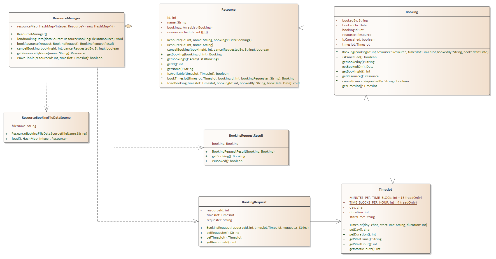

# L02 - ResourceBooking

# Overview

The project name of this exercise is L02 - ResourceBooking

The purpose of this assignment is to get more familiar with multiple class software systems and to gain a better understanding of how UML relationships map to Java code

## Problem Description

Our problem under study is a resource booking system. In this system, a resource anything (e.g. room or equipment) that can be scheduled (aka booked).  

Note that none of the classes here have anything to do with user interaction. It is merely the API that can be used by user interface code to do bookings an cancellations.

Below are the key classes to make up the system.  Study the UML diagram carefully and try to understand what it does. Try to understand the relationships. Some methods may not make sense at this time. Don't worry if you don't fully understand. We'll dive into it in  a couple of weeks.  Your main goal is going to be to translate to a code skeleton in Java

- Core Classes
  - Resource - Anything that can be booked
  - ResourceManager - The class responsible for managing resources. Through this class resources can be booked / scheduled or cancelled. 
  - Booking - Represents the scheduling of a resource at given start time for a specific duration (e.g. Downstairs conference room is scheduled at Monday at 10am for 30 mintues)
  - Timeslot - Represents a day, time, and duration. used to represent the time aspects of the booking
- Support Classes
  - BookingRequest - A BookingRequest is passed to the ResourceManager asking to request a specific Resource 
  - BookingRequestResult - An object of this class is returned by the ResourceManager and represents the result of the request to book the Resource. The result will contain information on whether or not the request was successful and, if successful, a reference to the Booking object
  - ResourceBookingFileDataSource - This is an infrastructure class which allows us to load from a file source. In this case, a simple CSV file
- Relationships
  1. ResourceManager aggregates ( <>------> ) Resource - ResourceManager has a collection of Resource objects because it can manage many rooms and equipment
  2. ResourceManager depends on BookingRequest - The dependency exists because the  bookResource method accepts a BookingRequest object
  3. ResourceManager depends on BookingRequestResult - The dependency exists because the  bookResource method returns an object of this type
  4. ResourceManager depends on ResourceBookingFileDataSoruce -  The dependency exists because theloadBookingData method an accepts an object of ResourceBookingFileDataSource 
  5. Booking has an association relationship (solid line with open arrow)  to Resource. This is because the Booking object has an underlying instance variable object reference to Resource.
  6. Booking has an association relationship to Timeslot - This is because each Booking has an instance variable object reference pointing to a Timeslot object representing the time and duration of the booking
  7. BookingRequest has an association relationship to Timeslot - This is because each BookingRequest has an instance variable object reference pointing to a Timeslot object representing the time and duration of the booking request
  8. BookingRequestResult has an association relationship to Booking. If the request is successful, the result will contain an instance variable object reference to the Booking object. If failed, the reference will be null




### Sample Client Code

The following sample shows what client code using a command line user interface might look like

```Java
ResourceManager resMgr = new ResourceManager();

// Load some existing data - we'll do a file, but could be from a database.
ResourceBookingFileDataSource dataSource = new ResourceBookingFileDataSource("BookingData.csv");
resMgr.loadBookingData(dataSource);


// Make a booking request for Monday at 10am for 30 minutes
Timeslot timeslot = new Timeslot('M', "10:00", 30);
String bookedBy = "James";
BookingRequest request = new BookingRequest(1, timeslot, bookedBy);

BookingRequestResult result = resMgr.bookResource(request);
int bookingId = result.getBooking().getBookingId();
if (result.isBooked()){
    System.out.printf("Your booking request was successfully created. Your booking ID is %d%n", bookingId);
} else{
    System.out.println("Your booking request was not available.");			
}

String cancelBy = "Joe";
boolean isCancelled = resMgr.cancelBooking(bookingId, cancelBy);
if (!isCancelled){
    System.out.printf("Cancel booking failed as resource was booked by %s, not %s%n", result.getBooking().getBookedBy(), cancelBy);

    System.out.printf("Now attempting to cancel by %s%n", bookedBy);
    isCancelled = resMgr.cancelBooking(bookingId, bookedBy);
    System.out.printf("Cancellation was %s%n", isCancelled ? "succesful" : "not successful");
    System.out.println(".");
} else{
    System.out.printf("Booking cancelled by %s", bookedBy);
}

```


## Requirements

Create the class structures shown by the UML diagram. At this time, you don't have to provide the logic of how this works

1. All shown classes, methods, and instance variables must be implemented precisely (i.e. names, upper / lower case preservation), so check spelling. Also, ensure that public (+), package (~), and private (-) identifiers are correctly implemented
2. You may NOT add any public methods and for this lab there isn't any reason to add private ones at this time since you aren't going to implement the internal logic yet, but I won't restrict you on this
3. For simple methods that don't have logic, including constructors, accessors and mutators, you must provide at least empty method stubs. Again you don't have to provide any logic at this time.
4. The code must compile, so even for methods that have logic that return something, you must return either the default value (e.g. true / false for a boolean) or null if it returns an object
5. Once again, you do NOT need to implement the scheduling logic in this lab. That will happen in the next lab

## Getting Started

Using the techniques shown on the instruction page [How to Start Every Java Project in this Course](https://canvas.sbcc.edu/courses/25771/modules/items/760779), create a new project from the GitHub classroom assignment.

Create the necessary class files in the **src/main/java/edu/sbcc/cs105** folder and add the appropriately named classes to them

Open up each class file and create the class structure. Add the standard header to the file.  The template for this header is available at: https://drive.google.com/open?id=1XLCgOqdXc9p7syhL0-VGlCc-q12actG-

You do not need to provide JavaDocs at this time  

You do not need to test the code generated, but it MUST COMPILE

## Running Unit Tests

No unit tests are provided or required

## No UML Diagram for the Project

No UML diagram is required for this project as one has been provided for you.

## Submitting Your Assignment

Follow the standard instructions for submitting a Java assignment: [How to Submit Assignments](https://canvas.sbcc.edu/courses/25771/pages/how-to-submit-assignments-new?module_item_id=761292). Don't expect any unit test results from the build server for this one.
