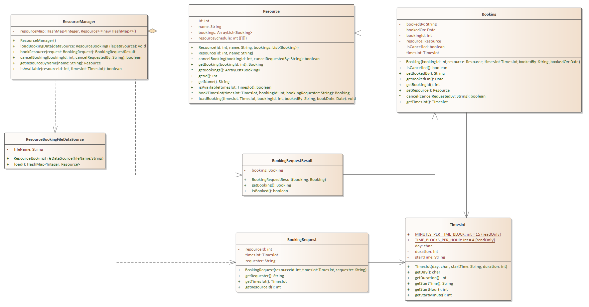
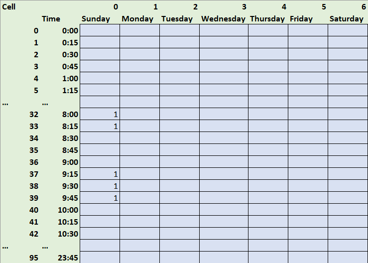

# L03 - ResourceBooking

# Overview

The project name of this exercise is L03 - ResourceBooking

The purpose of this assignment is to get more familiar with multiple class software systems and to gain a better understanding of how to create object-oriented systems with more complex relationships

## Problem Description

Our problem under study is a resource booking system. In this system, a resource anything (e.g. room or equipment) that can be scheduled (aka booked). *For simplicity, our problem will only deal with booking for a single week*.

Here is the class diagram from L02 for which you should have already created the structure. Please review L02 to understand the relationships. I have repeated the descriptions of the classes here for your benefit

- Core Classes
  - Resource - Anything that can be booked
  - ResourceManager - The class responsible for managing resources. Through this class resources can be booked / scheduled or cancelled. 
  - Booking - Represents the scheduling of a resource at given start time for a specific duration (e.g. Downstairs conference room is scheduled at Monday at 10am for 30 minutes)
  - Timeslot - Represents a day, time, and duration. used to represent the time aspects of the booking
- Support Classes
  - BookingRequest - A BookingRequest is passed to the ResourceManager asking to request a specific Resource 
  - BookingRequestResult - An object of this class is returned by the ResourceManager and represents the result of the request to book the Resource. The result will contain information on whether or not the request was successful and, if successful, a reference to the Booking object
  - ResourceBookingFileDataSource - This is an infrastructure class which allows us to load from a file source. In this case, a simple CSV file





Your task is to complete the code for the remainder of the system

- **Booking**
- - Constructor - initialize object
  - Standard accessors only per UML
- **cancel** method - Logic that only allows the requestor to cancel it. Returns false if attempt made by other user
- **BookingRequest** 
  - Constructor - initialize object
  - Standard accessors only per UML
- **BookingRequestResult**
  - Constructor - initialize object
  - Standard accessors only per UML
- **Resource**

  - Constructors
    - (id, name, bookings) - Initializes object and loads bookings from external source. Will need to load both bookings array list and the resource array
    - (id, name) - Initializes object. New Resource without any bookings.
  - Standard accessors for **getId**, **getName** per UML
  - **isAvailable** - checks the resourceSchedule array and verifies that the requested timeslot is not in use (either partially or fully).  See Storing Booking Data As Array Information below
  - **bookTimeslot** - calls isAvailable and, if true, sets the schedule array for the appropriate blocks to the value 1 (indicating booked). See Storing Booking Data As Array Information below
  - **loadBookingData** - loads  the timeslot data into the schedule array and creates a booking object. Meant to load pre-existing data from, for example, a file or database. It does not need to check availability, but assumes it is okay.
  - **cancelBooking**
  - find the booking in bookings array list
    - attempt to cancel it
    - if sucessful, clear the array that 
- **ResourceBookingFileDataSource** - Provided for you. Copy it from the code directory to the appropriate folder under the src folder.
- **ResourceManager**
  - Not a method per se (could be) - Needs to be able to generate the next booking ID when a booking is requested by getting the current highest booking ID and adding 1 to it
  - **loadBookingData** - uses the provided ResourceFileDataSource object to load the HashMap.
  - **bookResource** - Accepts a BookingRquest and, before passing request to the appropriate resource, ensures the request falls between Monday thru Friday, 8am - 5pm
  - **cancelBooking** - delegates the cancel request to the appropriate resource
  - **getResourceByName** - returns the named resource
  - **isAvailable** - delegates the call to the appropriate resource and returns the result
- **Timeslot**

  - Constructor - initialize object
  - Standard accessors only for **getDay**, **getDuration**, **getStartTime**
  - **getStartHour** - parse the hour component from the start time
  - **getStartMinute** - parse the minute component from the start time


## Storing Booking Data As Array Information

It may help to have a visual representation of the schedule to conceptualize it and make it easier to program. In the diagram below, the 2-D array is the blue shaded cells. The time is in 15-minute increments starting at midnight (0:00) and ending at 23:45, so there are 96 rows. The columns represent the day of the week. A '1' in any cell means that the 15 minute block for that time is booked; the values for non-booked should be 0 (I omitted here so the booked times were clear). As you can see below, there is a meeting booked from 8:00 to 8:30 and from 9:15 to 10:00. 

The trick in scheduling is first translating your time into the corresponding array index. If I wanted to book 8:15 for 45 minutes, first I would decompose the hour and minute components into the number of 15 minute blocks (8 * 4 blocks / per hour 15 / 15 minute intervals / block) = 33. Second, I would check the value of the cells at starting block until the number of blocks of the duration of the meeting (45 / 15) = 3. So, I would check 33, 34, and 35. 

When scheduling, I just have to set '1's in the available blocks.

Determining suggested alternatives is very similar, except that I start with the earliest start time on Monday (08:00) and end with the latest end time on Friday (17:00). The ResourceManager is responsible for knowing the constraints (M-F, 8-5) and enforcing them (should reject any invalid request), but will pass that info to Resource when asking for booking suggestions in order to give it the appropriate guidance (see clarification above this paragraph). Assume that for Sunday, a U would be the character and for Saturday, an S, even though as it currently stands, these will be rejected. If a reservation would extend past the current day's latest end, then the code should switch to the earliest start on the next day. 

Dealing with overlapping: If allowOverlappingSuggestions is true, then the scheduler might return 08:30, 10:00, 10:15, and 10:30 if 4 suggestions were asked for and all blocks between 10:00 and 11:15 were open. If non-overlapping, it would return 08:30, 10:00, 10:45, and 11:30 (assuming all blocks were open)



## Getting Started

Using the techniques shown on the instruction page [How to Start Every Java Project in this Course](https://canvas.sbcc.edu/courses/25771/modules/items/760779), create a new project from the GitHub classroom assignment.

From your L02 project, copy all the java files  in the **src/main/java/edu/sbcc/cs105** folder.  Copy the ResourceBookingFileData source file from the L03 **/code** directory to the **src/main/java/edu/sbcc/cs105** folder and overlay the one you created.

Open up each class file and create the class structure. Add the standard header to each file.  The template for this header is available at: https://drive.google.com/open?id=1XLCgOqdXc9p7syhL0-VGlCc-q12actG-

**You'll have to add the proper Javadoc documentation** as well as the proper code to solve the problem. You will have to add instance variables, constants, method stubs, and code to get this class defined properly. Read the comments (and the problem) to understand what the problem is and how you will solve it.  

You will need to add test code to **Program.java** to test your source code. 

Once you've written your code run the code by right clicking on **Program.java** in the file explorer and selecting **Run** from the context menu or using the debug tool from the **Activity Bar**. Examine the output. Does it do what you want? If not, how can you modify the code to do what you want?

## Testing Your Code

The file bookingdata.csv (in the root folder) has been provided for you to preload some booking data into your resource manager. I am also providing the following code to help you test your code. You may have to adjust

```Java
ResourceManager resMgr = new ResourceManager();

// Load some existing data - we'll do a file, but could be from a database.
ResourceBookingFileDataSource dataSource = new ResourceBookingFileDataSource("BookingData.csv");
resMgr.loadBookingData(dataSource);


// Make a booking request for Monday at 10am for 30 minutes
Timeslot timeslot = new Timeslot('M', "10:00", 30);
String bookedBy = "James";
BookingRequest request = new BookingRequest(1, timeslot, bookedBy);

BookingRequestResult result = resMgr.bookResource(request);
int bookingId = result.getBooking().getBookingId();
if (result.isBooked()){
    System.out.printf("Your booking request was successfully created. Your booking ID is %d%n", bookingId);
} else{
    System.out.println("Your booking request was not available.");			
}

String cancelBy = "Joe";
boolean isCancelled = resMgr.cancelBooking(bookingId, cancelBy);
if (!isCancelled){
    System.out.printf("Cancel booking failed as resource was booked by %s, not %s%n", result.getBooking().getBookedBy(), cancelBy);

    System.out.printf("Now attempting to cancel by %s%n", bookedBy);
    isCancelled = resMgr.cancelBooking(bookingId, bookedBy);
    System.out.printf("Cancellation was %s%n", isCancelled ? "succesful" : "not successful");
    System.out.println(".");
} else{
    System.out.printf("Booking cancelled by %s", bookedBy);
}
```


## Running Unit Tests

No unit tests. You are entirely responsible for making sure your code works correctly.  You could write your own unit test file if you were so inclined.

## No UML Diagram for the Project

No UML diagram is required for this project as one has been provided for you.

Create a UML diagram for this class based upon the specifications including all classes and relationships

## Submitting Your Assignment

Follow the standard instructions for submitting a Java assignment: [How to Submit Assignments](https://canvas.sbcc.edu/courses/25771/pages/how-to-submit-assignments-new?module_item_id=761292). Once you have submitted your assignment, it is a good idea to check the branches section of GitHub a few minutes later to see if your unit tests passed on the build server (green checkmark is good, red X is bad)
