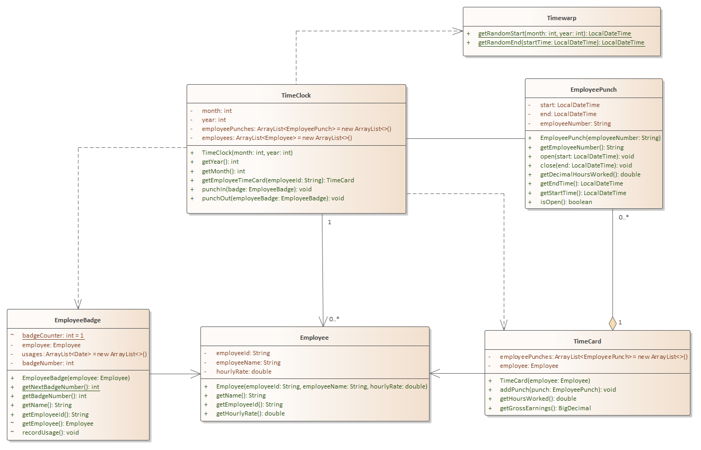

# Problem1 - Timeclock (75 points)

## Problem Description

You will create an object-oriented system that represents a time clock system in an work environment

**Problem Context**

A Time Clock is used in an employment scenario to allow employees to punch in and punch out for their shift.  To do this, an Employee uses their Employee Badge (An identification card) that has their employee information encoded in it.  Each shift or part of a shift (if they leave for lunch) is captured by an Employee Punch. When the punch in, the start time is recorded. When they punch out, the end time is recorded. From that information, their hours worked can be captured.  After a pay period elapses (e.g. a Month), their Time Card can add up the employee punches and calculate their gross earnings (before taxes).


## 

**Explanation of Relationships**

- TimeClock depends on EmployeeBadge because the punchIn / punchOut methods require passing their badge to the method
- TimeClock depends on TimeCard because it creates a TimeCard when getEmployeeTimeCard is called
- TimeClock depends on Timewarp because it calls its two static methods
- TimeClock has an an association to Employee with because it maintains a list of employees
- TimeClock has an association to EmployeePunch because it maintains a list of EmployeePunch objects
- TimeCard has an aggregation (whole / parts association) of EmployeePunch objects because it maintains a list of these object 
- Each TimeCard is associated with a single Employee
- Each Employee Badge is associated with a single Employee

**Helper Info**

- The class Timewarp is provided to you to simulate the passage of time. Use the static methods getRandomStartTime and getRandomEndTime to get the start and end times for a shift where indicated in the requirements below.
- If you receive a <classname> cannot be resolved to a type, that typically means you don't have an import statement for that class. You will run into that with some classes used here: LocalDateTime and Duration.
- While you will use LocalDateTime for storing date and time, you will not have to interact with its methods.

## Requirements

- In the **edu.sbcc.cs105.p1** folder, create your code

- Put any client code in Problem1.java **run** method.

- Convert the following UML diagram into code structure with all of the attributes, operations, and relationships. The relationships are inherently created by the structure provided. 

  - The EmployeeBadge class has already been created for you.
  - The Timewarp class has been created for you.

- The code must compile, so work on the total structure first, then simple accessors / mutators, and stub out more complex methods so that it always compiles

- **TimeClock**

  - Each TimeClock object is used for a given Month and Year - Complete appropriate initialization and accessors/mutators
  - *punchIn* method - Do the following
    - Verify there is not an open employee punch for the given badge / employee in the employeePunches list. If there is, return false
    - Get the start time of the punch by calling Timewarp.getRandomStart
    - Create the employee punch and "open" the punch
    - If the employee doesn't exist, add them to the employee list
    - Add the punch to the employeePunches list.
  - *punchOut* method - Do the following
    - Get the open punch for the provided badge / employee
    - Use the the Timewarp class to get the end time
    - Close the punch
    - If an open punch does not exist, throw an exception with the message: No open punch for this employee
  - *getEmployeeTimeCard*
    - Create a new TimeCard for the given employee and add all of their punches. This will require you to work with both the employees list and the employeePunches list
    - Return the timecard

- **EmployeePunch**

  - Perform standard initialization of instance variables plus accessors / mutators

  - *open* sets the start time

  - *close* sets the end time

  - Paste the following code into getDecimalHoursWorked

    - ```Java
       final int MINUTES_PER_QUARTER_HOUR = 15;
       final double FRACTIONAL_QUARTER_HOURS = .25;
        
       double hoursWorked = 0;
        
       Duration duration = Duration.between(start, end);
                     
       int hoursPart = Math.abs(duration.toHoursPart());
       int minutesPart = Math.abs( duration.toMinutesPart());
        
      // Convert fractional minutes into .25 hour increments
      double minutesInQuarterHoursWorked = 
      (int) minutesPart / MINUTES_PER_QUARTER_HOUR * FRACTIONAL_QUARTER_HOURS;
      
      hoursWorked = hoursPart + minutesInQuarterHoursWorked;
      
      return hoursWorked;
      ```

      

- **TimeCard**

  - Perform standard initialization of instance variables via constructor
  - *addPunch* - adds the provided punch to the list
  - *getHoursWorked* - calculates the total number of hours worked by processing the employeePunches
  - *getGrossEarnings* - calculates and returns gross earnings by the formula: earnings = hours * pay rate. Inspect the available data to determine where to get these

- **Employee**

  - Perform standard initialization of instance variables plus accessors / mutators
  - There is no complex logic

  

## Testing Your Code

No unit tests are provided. However here is some sample usage code

```Java
// Joe's getting $15 per hour. Awesome!
Employee e1 = new Employee("12345", "Joe", 15.0);
EmployeeBadge badgeE1 = new EmployeeBadge(e1);

// Create a new Timeclock for Nov 2019
TimeClock tc = new TimeClock(11, 2019);

tc.punchIn(badgeE1);
tc.punchOut(badgeE1); 

tc.punchIn(badgeE1);
tc.punchOut(badgeE1); 

tc.punchIn(badgeE1);
tc.punchOut(badgeE1); 

TimeCard card = tc.getEmployeeTimeCard(e1.getEmployeeId());
System.out.printf("Employee %s worked %.2f hours at $%.2f and earned $%.2f%n", 
    e1.getName(), 
    card.getHoursWorked(), 
    e1.getHourlyRate(),
    card.getGrossEarnings());
```


