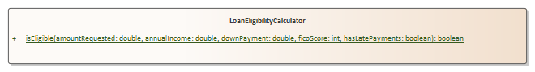

# Problem 2 - Loan Eligibility Calculator (Simplified) - 25 points

## Problem Context

You are creating a business class for a Bank that will determine eligibility for a loan.  The calculator will accept several pieces of information (amount requested, annual income, down payment, FICO score, and whether the borrower has a late payment history). Based upon the rules provided below, create the solution that satisifies the requirements.

## Requirements

1. In the **edu.sbcc.cs105.p2** folder, create your code

2. Convert the UML class below to code. Names of the class, method, and parameters must all be correctly spelled including the case of the letters (upper / lower)

3. Rules for eligibility - Return true for cases matching Rule A, B, or C below

4. Put any client code in Problem2.java **run** method.

5. Code must compile

   | **Rule** | **FICO   (credit) Score** | **Borrower   Annual Income as % of requested loan amount** | **Down   Payment as % of requested loan amount** | **Can   have late payments** | **Eligible** |
   | -------- | ------------------------- | ---------------------------------------------------------- | ------------------------------------------------ | ---------------------------- | ------------ |
   | A        | 700+                      | At least 15%                                               | More than 10%                                    | n/a                          | Yes          |
   | B        | 600+                      | At least 20%                                               | More than 15%                                    | n/a                          | Yes          |
   | C        | 600+                      | At least 15%                                               | More than 15%                                    | No                           | Yes          |

