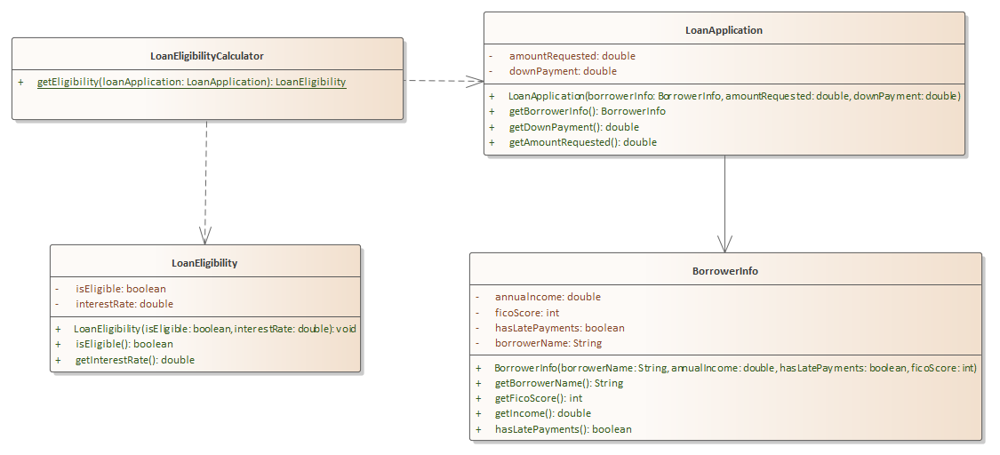

# Problem 2 - Loan Eligibility Calculator - 50 points

## Problem Context

You are creating an object-oriented solution for a Bank that will determine eligibility for a loan.  The calculator will accept a loan application that specifies the desire loan parameters as well as information about the borrower. Based upon the rules provided below, create the solution that satisfies the requirements.



## Explanation of Relationships

- LoanEligibilityCalculator depends upon LoanApplication because getEligibility accepts an object of this type
- LoanEligibilityCalculator depends upon LoanEligibility because getEligibility returns an object of this type
- LoanApplication is associated with BorrowerInfo as it maintains a reference to an object of this type that it receives as a constructor argument

## Requirements

1. In the **edu.sbcc.cs105.p3** folder, create the code for the UML diagram above.
2. All attributes, operations, and relationships must be correctly represented including spelling and case. Hint: associations sometimes have an attribute that is not explicitly defined
3. All basic object initialization plus accessors must be implemented
4. Implement **getEligibility** must calculate and return a **LoanEligibility** object based upon the logic below
5. Put any client code in Problem3.java **run** method.
6. Code must compile

## Rules for Loan Eligibility

| **Rule** | **FICO  (credit) Score** | **Borrower  Annual Income as % of requested loan amount** | **Down  Payment as % of requested loan amount** | **Can  have late payments** | **Eligibility** |
| -------- | ------------------------ | --------------------------------------------------------- | ----------------------------------------------- | --------------------------- | --------------- |
| A        | 700+                     | At least 15%                                              | More than 10%                                   | n/a                         | 4%              |
| B        | 600+                     | At least 20%                                              | More than 15%                                   | n/a                         | 5%              |
| C        | 600+                     | At least 15%                                              | More than 15%                                   | No                          | 5.25%           |

Helpful Hint

Assume you are in the getEligibility method and you want to retrieve borrower information, but you only have a direct reference to LoanApplication. LoanApplication has a reference to BorrowerInformation. Your code might look like this;

```Java
int ficoScore = loanAppRef.getBorrowerInfo().getFicoScore();
```

