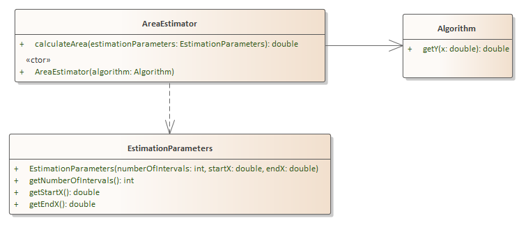

# Problem 4 - Area Estimator- 50 points

## Problem Context

You are going to create an object-oriented solution that estimates the area under a bounded curve for a given algorithm (to be provided below)

## Requirements

1.  Implement the application from the UML diagram above that estimates the area under the curve by using the formula for the curve **y = f(x)** to determine the height of each rectangle  at each interval **x**

2. The EstimationParameters consists of 3 pieces of data 

   n – number of intervals (rectangles), 

   x0 – starting x, 

   xn – ending x. 

3.  The Algorithm class will implement the algorithm: **y = x2 - 3x + 1** and will be called multiple times from AreaEstimator (once for each x / interval)

4.  An instance of the algorithm will be passed to the AreaEstimator constructor

5. The area calculator will use a LEFT Riemann Sum (see problem background) for the expression

6. Put any client code in Problem4.java **run** method.

7. Code must compile

## Problem Background and Information (only read if necessary for understanding).

If we want to calculate the area under a curve, we can approximate it (with a margin of error) using something called Riemann sums. In essence, we are summing up the area of a number of rectangles that “fit” the curve. In the graphic example below for the curve **y = x3**, we have what is called a Left Riemann Sum where Left indicates we using the left edge of the rectangle as the height. A Right Riemann Sum would use the right edge of the rectangle as the height.

 

