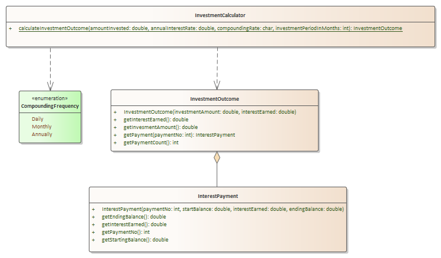

# Problem 5 - Investment Calculator - 50 points

## Problem Context

You are going to create an object-oriented solution that calculates the investment outcome for a given investment. This is similar to the loan amortization problem, but instead of paying down a balance, we are going to accrue interest periodically on an investment for a fixed period of time.

- The amount invested is the starting amount
- The compounding rate is how often interest is calculated (daily, monthly, or annually)

### Explanation of Relationships

- InvestmentCalculator depends upon InvestmentOutcome because it creates and returns an object of that type as part of the method calculateInvestmentOutcome
- InvestmentCalculator depends upon the CompoundingFrequency enumeration because the calculateInvestmentOutcome accepts the enumeration type as a parameter
- InvestmentOutcome aggregates InterestPayment as it has a *list* of InterestPayment objects

## Requirements

1. In the **edu.sbcc.cs105.p5** folder, Create the class structure for the UML diagram above completing all classes, methods, and relationships. Additionally, you will have to provide the corresponding attributes *that are not shown*. **CompoundingFrequency** and **InterestPayment** have been provided for you, so you don't need to create those.
2. Complete the logic for **calculateInvestmentOutcome** method

- Determine the number of investment payments by understanding the relationship between how long the investment is and the number of compounding periods per year (using compounding frequency)
- Calculate the interest rate per payment by dividing the annual interest rate by the number of compounding periods per year
- Use a loop to calculate each interest payments 
- Note that in InterestPayment, endingBalance is startingBalance + interestEarned

3. Put any client code in the Problem5.java run method.