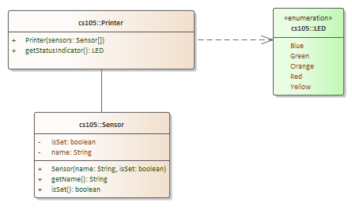

# Problem 6 - Printer Status - 25 points

## Problem Context

You are going to create an object-oriented solution that simulates the sensors and LED (light emitting diodes) for a printer with the following characteristics

The printer has six sensors: 

- Sensor A which detects if the printer is out of paper
- Sensor B which detects if the printer is out of ink
- Sensor C which detects if the printer needs servicing
- Sensor D which detects if the printer is jammed
- Sensor E which detects if the printer is offline
- Sensor F which detects if an internal electronics error

## Requirements

1. Write a class called CustomPrinter
2. Add a method to CustomPrinter with the following signature: **getStatusIndicator(Sensor[] sensors) : LED**  (an enum) which returns the LED color for the conditions below
3. Create a Sensor class
4. Create an LED enumeration with the values in the table below  
5. Put any client code in Problem6.java **run** method.
6. Code must compile

| **Sensor  State Group** | **Sensor  State**                                            | **Result** |
| ----------------------- | ------------------------------------------------------------ | ---------- |
| 1                       | No sensors set                                               | LED.Green  |
| 2                       | Out of ink                                                   | LED.Blue   |
| 3                       | Out of paper or is jammed                                    | LED.Yellow |
| 4                       | Needs servicing or internal  electronics error               | LED.Orange |
| 5                       | Any combination of sensors set that  contains items across sensor state groups 2 – 4 | LED.Red    |